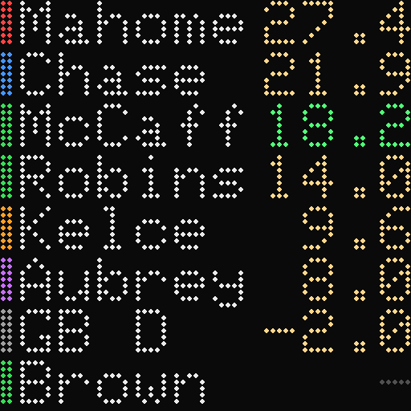
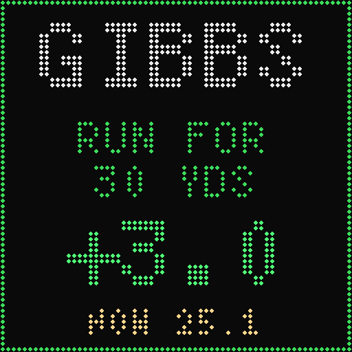

# pio-chriss-scoreboard

A live fantasy football scoreboard for a 64×64 HUB75 LED panel on the **Waveshare ESP32-S3-RGB-Matrix** board. It shows up to 9 chosen players on one screen with their fantasy points for the current NFL week, a football next to anyone whose team has the ball, and a total line with rotating NFL scores. When a player scores, the whole panel celebrates and then shows what happened. The players are picked on a web page served by the board.





*The scoreboard, and the update screen shown after a celebration. Both drawn offline with the panel's fonts from made-up data (`tools/render_preview.py`); not photos.*

Plain-language instructions for guests (finding the board, picking players): [`GUIDE.md`](GUIDE.md).

## Status (2026-09-27)

| Version | What | On hardware |
|---|---|---|
| v0.1 | picker page, weekly points, 8 rows | **works** (tested by the owner) |
| v0.2 | 9 players, pages, game score lines with possession, name sizes, startup animation, faster OTA and `ota` target | not yet flashed |
| v0.3 | long labels shortened from the middle | not yet flashed |
| v0.3.1 | fix: ESPN scoreboard parse failed (JSON nesting limit) | not yet flashed |
| v0.4 | all 9 players on one screen; score lines and pages removed; possession shown as a brown football before the points; Medium is the default name size | not yet flashed |
| v0.4.1 | panel order set on the web page with ↑/↓ buttons instead of by points | not yet flashed |
| v0.4.2 | OTA back to a plain `esp32s3-ota` environment (the custom `ota` target is removed) | not yet flashed |
| v0.5 | 5 px font and 10 lines: 9 players plus a total line with rotating NFL scores; full-screen celebration and update screens when points change; test button; name-size setting removed | running; NFL scores missing (fixed in v0.6) |
| v0.6 (current `main`) | fix: NFL scores and possession (ESPN reply read in full before parsing); a celebration for each kind of play, touchdowns separate; every gain celebrates; one test button per celebration | flashed by OTA 2026-09-27; scores confirmed through `/api/config`, celebrations not yet watched |

Open points:
- **Possession marker:** checked against live games on 2026-09-27 at 17:20 UTC; the fields are as expected (see the ESPN section). v0.2 and v0.3 had a bug: ArduinoJson's default nesting limit rejected ESPN's reply, so every scoreboard fetch failed. It is fixed on `main` (v0.3.1).
- **OTA flashing speed:** flashing firmware over WiFi was very slow on v0.1. The fix (WiFi modem sleep off) is part of the firmware on the board, so it only helps once v0.2 or later is running: the OTA flash that installs v0.2 over v0.1 is still slow (or flash that one over USB). The speed of later OTA flashes has not been measured.
- **Data delay:** how soon points and possession on the panel change after a play has not been measured.
- **Event descriptions:** built from Sleeper stat names seen in week 2 replies (`rush_yd`, `rec_yd`, `pass_td`, `fgm_yds`, `sack`, ...). `pass_int`, `fum_lost`, `int` and `fum_rec` did not appear in those replies; their names are unverified.

## What it shows

- **Startup:** a football is kicked through the goalposts, a rainbow pinwheel spins up and dissolves into confetti, and the panel says "GOOD AFTERNOON CHAMPIONS !!!" (about 9 s, while WiFi connects). `STARTUP_ANIMATION 0` skips it.
- **Players:** up to 9, top to bottom in the order set on the web page with the ↑ and ↓ buttons. `SORT_BY_POINTS 1` in `src/main.cpp` sorts by points instead.
- **Layout:** 10 lines of 5 px text (X11 4×6 font), 6 px apart.
  - Rows 0–53: up to 9 player rows.
  - Row 55: dotted divider.
  - Rows 57–61: the total line.
- **Each player row:**
  - a position bar on the left: QB red, RB green, WR blue, TE orange, K purple, DEF grey
  - the label (editable on the web page). A label too wide for the row is shortened from the middle, so it stays readable: doubled letters, then vowels, then other letters go, keeping the first and last letters (`Washington` → `Washngtn`). See `src/abbrev.h`.
  - a small football (5×3, brown with a white lace) just before the points while the player's team has the ball. It turns red inside the opponent's 20. While the player's game is live, the football's space stays reserved, so the label doesn't change length every time possession changes.
  - this week's points, right-aligned
- **Total line:**
  - right: the total of all players' points, in gold
  - left: NFL games in rotation, 3 s each; live games first, then finals, then games not started. Live games are white (`KC 17 MIA 10`), finals grey, upcoming games blue (`ARI - SF 4:05P`, or `ARI - SF` when the time does not fit). A score too wide for its space is squeezed (spaces dropped, then the narrower TomThumb font).
- **When a player gains points** (any amount), or loses at least `EVENT_MIN_PTS` (1.0) in one fetch, the scoreboard gives way to full screens, then returns:
  1. **Celebration** (gains only, `src/celebrate.cpp`), picked by the kind of play:
     - **Rush** (3 s): the ball carrier sprints down a scrolling field, hops a diving defender, `RUSH!`
     - **Pass / Catch** (3 s): a spiral from the quarterback to the receiver, sparks at the catch, `COMPLETE!` or `CAUGHT IT!`
     - **Defense** (3 s): a hit with a shockwave and screen shake, the ball pops loose, then a flashing D and fence
     - **Kick** (3 s): behind the kicker, the ball flies through the uprights, `GOOD!` with confetti
     - **Touchdowns** (3.5 s), one scene per kind:
       - rushing: sprint, the end zone scrolls in, a dive over the goal line, a spike, `TOUCHDOWN!` scrolling across the sky
       - passing: the quarterback's bomb leaves the top of the screen and drops into the end zone; its path stays as a rainbow arc, `DIME!`
       - receiving: toe-tap catch in the end zone, a leap into the stands, the crowd goes wild, `SIX!`
       - defensive: the defender jumps a throw and returns it the length of the field, `TO THE` `HOUSE!`
     - **Other** (3 s): fireworks
  2. **Update screen** (3.5 s): the player's name in large letters, what happened, the points gained (green) or lost (red), and the player's new total.
  - **What happened** comes from comparing the player's stats with the previous fetch. In order of priority: a touchdown (`RUSHING TD`, `RECEIVING TD`, `TD PASS`, `DEFENSIVE TD`), a field goal with its distance, an interception, a fumble recovery or a sack for a defense, `INTERCEPTED` or `FUMBLE LOST`, then yards (`RUSH FOR 30 YDS`, `CATCH FOR 12 YDS`, `PASS FOR 45 YDS`), then `EXTRA POINT`. Several plays can happen between two fetches (30 s); yards are then the total.
  - Several changes in one fetch are shown one after another, up to 6 queued.
  - The **Test celebration** buttons on the web page (Rush, Catch, Pass, Defense, Kick, the four touchdowns, Other) play that celebration and the update screen for the first player.
- **Points:**
  - `-` in grey: no stats this week yet (game not started, or bye)
  - green for 8 s after a change
  - all grey when no fetch has succeeded for 5 min
- **Status screens:**
  - "SET WIFI": `src/secrets.h` is missing
  - "WIFI..": connecting
  - "PICK PLAYERS" with the board's IP: no players chosen yet
- **Red pixel, bottom-right:** the last fetch failed. The web page shows the error code.

## Setup

1. Copy `src/secrets.example.h` to `src/secrets.h` (git-ignored) and fill in the WiFi SSID and password. Optionally set `OTA_PASSWORD`.
   - The board needs a WiFi network with internet access: it fetches points and possession itself.
   - There is no setup screen and no access-point mode. Changing networks means editing `secrets.h` and reflashing.
   - A phone hotspot works. The board then uses the phone's cellular data, roughly 30 MB per hour, almost all of it the ESPN scoreboard. Anyone using the picker page has to join the same hotspot.
2. Build and flash over USB:
   ```
   pio run -e esp32s3 -t upload
   ```
3. Open `http://scoreboard.local/` on a phone on the same WiFi, or use the IP shown on the panel. The panel shows its IP only while no players are chosen.
4. Search for players, add up to 9, put them in order with ↑ and ↓, pick the scoring format (PPR, half PPR, standard), and press **Save to panel**.

The roster, scoring format and brightness are stored in NVS and survive reboots.

### Entering a lineup in one step

From a computer on the same network, one request replaces the whole roster. Scoring and brightness stay as they are. IDs are Sleeper `player_id`s; team defenses use the team code.

```sh
curl -X POST http://scoreboard.local/api/config -H "Content-Type: application/json" \
  -d '{"players":[{"id":"12545","label":"Shough","pos":"QB","team":"NO"},{"id":"TEN","label":"Titans","pos":"DEF","team":"TEN"}]}'
```

PowerShell: `Invoke-RestMethod -Uri http://scoreboard.local/api/config -Method Post -ContentType application/json -Body '<same JSON>'`.

## How the picker works

- **Page source:** the board serves the page (`src/web_page.h`). Nothing needs to be installed on the phone.
- **Player list:** the page's JavaScript downloads Sleeper's player list directly from `api.sleeper.app`. Sleeper sends `Access-Control-Allow-Origin: *`, so the browser allows the request. The board never downloads the list.
- **Size:** six position-filtered requests (QB, RB, WR, TE, K, DEF; `active=true`), about 4 MB uncompressed in total. The page keeps only rostered players, about 900 of them.
- **Cache:** the trimmed list is stored in the browser's `localStorage` for 24 hours. Sleeper asks that the player list be fetched at most once a day.
- **What reaches the board:** only `{id, label, pos, team}` for each chosen player, via `POST /api/config`.
- **Internet:** the phone needs internet access, because the list comes from Sleeper and not from the board.

## Data source: Sleeper

Sleeper needs no API key and no account. Its documentation (docs.sleeper.com) says the API is free for non-commercial use, with a suggested ceiling of 1000 calls per minute.

| Call | Endpoint | Documented? | Size |
|---|---|---|---|
| Season/week | `https://api.sleeper.app/v1/state/nfl` | yes | ~200 B |
| Player list (browser only) | `https://api.sleeper.app/v1/players/nfl?position=QB&active=true` | yes | 5 KB (DEF) to 1.7 MB (WR) |
| One player's week | `https://api.sleeper.com/stats/nfl/player/<id>?season_type=regular&season=2026&week=3` | **no** | ~0.7–1.2 KB |

The stats endpoint is the one the Sleeper app itself uses. It is not in Sleeper's public documentation, so it can change without notice.

- **Reply:** the player's stat line for that week, or the literal `null` when there are no stats yet.
- **Points field:** the stat line includes Sleeper's computed fantasy points, so the firmware does no scoring maths. It reads one of these fields:
  - `pts_ppr`
  - `pts_half_ppr`
  - `pts_std`
- **Example (trimmed):**
  ```json
  {"week":3,"season":"2026","player_id":"11370","team":"GB","opponent":"ATL",
   "stats":{"pts_ppr":1.4,"pts_half_ppr":0.9,"pts_std":0.4,"rec":1.0,"rec_yd":4.0, ...},
   "player":{"first_name":"Chris","last_name":"Brooks","position":"RB", ...}}
  ```
- **Parsing:** ArduinoJson parses with a filter, so only `stats.<scoring field>` is kept.

**Possession (and the web page's game lines): ESPN.** `https://site.api.espn.com/apis/site/v2/sports/football/nfl/scoreboard` returns every game of the current week in one reply: teams, scores, status, quarter and clock. During a live game it also has `situation.possession` (the ID of the team with the ball) and `situation.isRedZone`. The endpoint is public, needs no key, and is not officially documented by ESPN.
- **Team codes:** ESPN's match Sleeper's except Washington (`WSH` at ESPN, `WAS` at Sleeper). The firmware converts it.
- **Checked live (2026-09-27, 1 PM games, 1st quarter):**
  - `situation.possession` is a string team ID (`"24"`) matching `competitors[].team.id`
  - `situation.isRedZone` is a boolean, `true` at "1st & Goal at PIT 3"
  - `score` is a string (`"7"`)
  - `status.type.name` is `STATUS_IN_PROGRESS`, `displayClock` is `"7:27"` or `"10:49"`
  - The firmware's filter and parsing, run on the computer against that reply, gave the right score, quarter, clock, team with the ball and red zone for all 9 live games.
- **Nesting depth:** the reply nests 15 levels deep, beyond ArduinoJson's default limit of 10, which applies even to the parts the filter skips. The firmware raises it to 32 (`JSON_NESTING_LIMIT`).
- **Still unseen:** the halftime status name (`STATUS_HALFTIME`).

**Player IDs.** Sleeper's `player_id` is a string. It is digits for players (`"4046"` is Patrick Mahomes) and the team abbreviation for team defenses (`"GB"`). The same ID works in every Sleeper endpoint. The player list also carries `espn_id`, `yahoo_id`, `gsis_id` (NFL) and `sportradar_id`, for cross-referencing other sources.

**Timeliness (unverified).** Sleeper's CDN caches the weekly stats reply for 4 s (`cache-control: s-maxage=4`), and the player-list reply for 600 s. How soon points move after a play has not yet been measured during a live game. The firmware polls every 30 s (`POLL_MS`).

## Load on the ESP32-S3

Small. Each poll round is:
- one HTTPS GET per player, at most 9, each about 1 KB, parsed with a filter so the JSON document holds a single number
- one HTTPS GET of ESPN's scoreboard, about 270 KB, parsed as a stream straight off the connection through a filter, so it is never held in memory whole

That runs in a background task on core 0, every 30 s. Each request opens a new TLS connection (HTTP/1.0, see below), which takes on the order of a second, so a full round takes a few seconds. The display and web server stay responsive on core 1 during a round.

Build output: RAM 13.1 % (43 KB static), flash 12.3 % (518 KB of the 4 MB app slot).

## Web API

| Method | Path | Body / reply |
|---|---|---|
| GET | `/` | the picker page |
| GET | `/api/config` | `{scoring, brightness, players:[{id,label,pos,team,pts,state,game}], season, season_type, week, status, last_ok_s}` |
| POST | `/api/test?kind=N` | plays a celebration and the update screen for the first player (made-up event). `N` 0–9: rush, catch, pass, defense, kick, rushing TD, receiving TD, passing TD, defensive TD, other; without `N`, the next one each time |
| POST | `/api/config` | `{scoring, brightness, players:[{id,label,pos,team}]}`, at most 9 players; replies like GET |

`state`: 0 not fetched yet, 1 no stats this week, 2 points valid. `status`: the last HTTP code, or −1 begin failed, −2 JSON parse error, −3 unexpected state reply.

## Updating over WiFi (OTA)

- **Setup:** set `OTA_PASSWORD` in `src/secrets.h`, and put the same value in the `SCOREBOARD_OTA_PASSWORD` environment variable (PowerShell: `$env:SCOREBOARD_OTA_PASSWORD = "..."`).
- **Upload:**
  ```
  pio run -e esp32s3-ota -t upload
  ```
  In VS Code: PlatformIO sidebar → **esp32s3-ota** → **Upload**.
- **Address:** `scoreboard.local`. If that doesn't resolve, add `--upload-port <panel IP>`.
- **First build:** PlatformIO builds each environment in its own folder, so the first `esp32s3-ota` build compiles everything once. Later builds are incremental.
- **Speed:** the firmware turns off WiFi modem sleep (`WiFi.setSleep(false)`). espota sends 1 KB at a time and waits for the board to answer each block. With modem sleep on, each answer could wait for the access point's next beacon, so a 520 KB image took minutes. The fix is in the firmware on the board, so the OTA flash that installs v0.2 or later over v0.1 is still slow. PlatformIO's OTA upload still prints a "Chunk response" line per block; that output is harmless.

## Repository layout

| Path | What |
|---|---|
| `src/main.cpp` | the application: display, Sleeper and ESPN fetch task, web server, OTA |
| `src/web_page.h` | the player picker page (HTML + JavaScript, served from flash) |
| `src/abbrev.h` | shortens labels from the middle to fit the row |
| `src/startup.cpp`, `src/startup.h` | startup animation |
| `src/fonts/` | X11 4×6 (rows) and 5×7 (update screen) fonts as Adafruit GFX headers, generated by `tools/bdf2gfx.py` from `tools/fonts/*.bdf` |
| `src/celebrate.cpp`, `src/celebrate.h` | celebrations per kind of play |
| `tools/render_preview.py` | redraws `docs/panel-preview.png` and `docs/update-preview.png` |
| `src/ESP32-HUB75-*`, `src/platforms/` | HUB75 panel driver vendored from Waveshare's Arduino examples (copied from infopanel64) |
| `src/secrets.example.h` | template for `src/secrets.h` |
| `partitions_32MB.csv` | flash layout (two 4 MB app slots) |
| `GUIDE.md` | step-by-step guide for guests: opening the page and picking players |
| `CLAUDE.md` | engineering notes and status |

## Credits and licences

- **HUB75 driver:** [ESP32-HUB75-MatrixPanel-DMA](https://github.com/mrcodetastic/ESP32-HUB75-MatrixPanel-DMA) by mrcodetastic, vendored from Waveshare's examples.
- **Board configuration:** Waveshare's [ESP32-S3-RGB-Matrix](https://www.waveshare.com/esp32-s3-rgb-matrix.htm) examples (Apache-2.0), via infopanel64.
- **Data:** [Sleeper](https://sleeper.com/), under its API terms (non-commercial use); game scores from ESPN's public scoreboard endpoint.
- **Fonts:** X11 misc-fixed 4×6 and 5×7 (public domain), taken as BDF from [olikraus/u8g2](https://github.com/olikraus/u8g2). TomThumb ships with Adafruit GFX.
